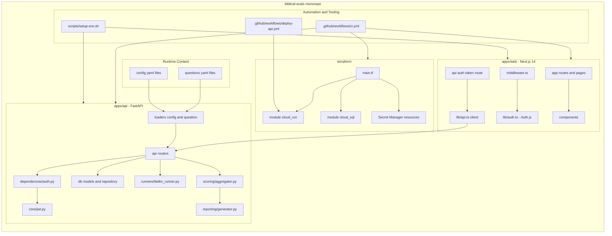
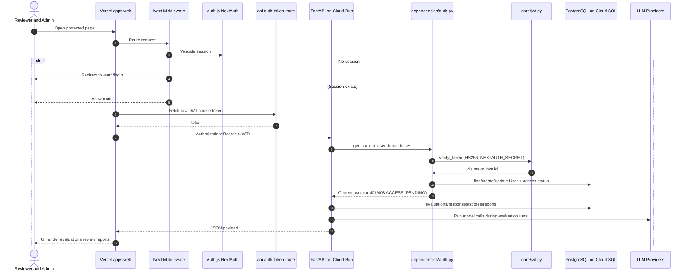
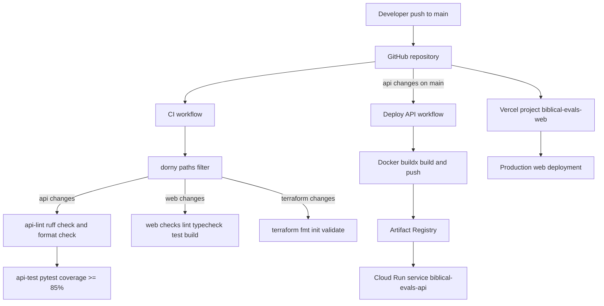
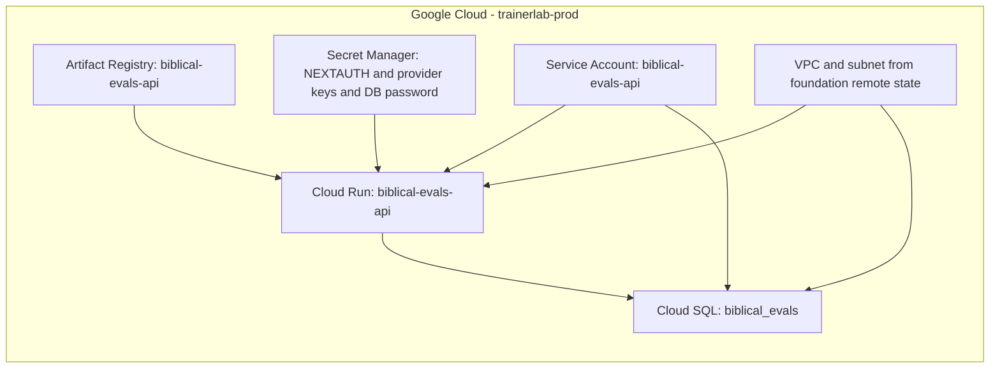

# Architecture Diagrams

This document gives a repo-wide view of how the web app, API, infra, and delivery pipelines fit together.

## 1) Monorepo Component Map

## 2) Runtime Request + Auth/Data Flow

## 3) Delivery Pipeline (CI + Deploy)

## 4) Cloud Infrastructure Topology (Terraform-Managed)

